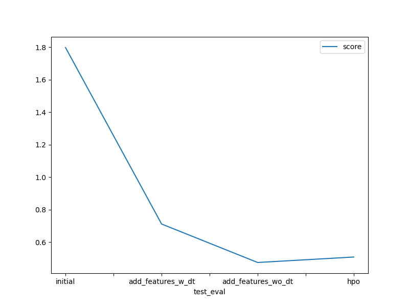

# Report: Predict Bike Sharing Demand with AutoGluon Solution
#### Geraldo Margjini

## Initial Training
### What did you realize when you tried to submit your predictions? What changes were needed to the output of the predictor to submit your results?
First, I uploaded the data provided by Kaggle directly into AutoGlue, specifying a limitation on training time and the evaluation of error using RMSE, along with the models I wanted to use. For the entire project, I will use four models: 
- **XGBoost**;
- **Random Forest**; 
- **GBM Regression**;
- **Neural Network**;
Before uploading the results to Kaggle, I made sure to run the *.describe()* method to confirm that the minimum value is greater than zero, as specified by Kaggle.

### What was the top ranked model that performed?
The model that performed best with AutoGluon was a Level 3 Ensemble among the four specified models. I saved and utilized the top 5 models obtained from TabularPredictor, plotted the leaderboard, and subsequently analyzed the score provided by Kaggle for each model.


## Exploratory data analysis and feature creation
### What did the exploratory analysis find and how did you add additional features?
Regarding the EDA (Exploratory Data Analysis), I started by plotting the data provided by Kaggle. From the bar charts, I noticed outliers, so I used the zscore library to eliminate them. I then plotted the correlation matrix to observe the influence of each feature on my target. The correlation matrix is particularly interesting because it helps us understand how much a feature impacts the target. However, the relevance of the correlation matrix diminishes in models where the target exhibits non-linear relationships with features or complex interdependencies among them. In such cases, it would be more appropriate to use other feature importance methods, such as SHAP.


For feature engineering, I observed that plotting the target variable over different times of the day revealed a significant increase in rentals during peak hours, so I decided to create a new feature to capture this pattern. My second feature involved categorizing temperature into three ranges, while the third feature described whether the period was close to summer. This decision was based on rental frequency graphs across seasons, which showed a noticeable increase in rentals during the summer period.


### How much better did your model preform after adding additional features and why do you think that is?
Once the same models were trained using the data processed with EDA, their performance improved, as shown in the figure.


## Hyper parameter tuning
### How much better did your model preform after trying different hyper parameters?
Regarding hyperparameter tuning, the parameters used turned out to be disappointing. The approach was not among the best, as neither of the two sets of hyperparameters I tested showed any improvement.


### If you were given more time with this dataset, where do you think you would spend more time?
If I had more time, I would have certainly refined my features further, performed a SHAP analysis to identify features that could be discarded, and verified whether their removal led to improved performance. Regarding hyperparameter tuning, I would have started with a grid search or a Bayesian search, progressively evaluating performance as I adjusted the parameters.

### Create a table with the models you ran, the hyperparameters modified, and the kaggle score.
|model|hpo1|hpo2|score|
|--|--|
|initial|1.42460|
|add_features|0.50483|
|hpo1|0.51566|
|hpo2|0.53583|

```
model_custom_hyperp = {
    "XGB":{ 
            "n_estimators": 3000,
            "max_depth": 4,
            "learning_rate": 0.01
    },
    "RF": {
            "n_estimators": 2000,
            "max_depth": 15,
            "min_samples_split": 5,
            "min_samples_leaf": 2,
            "max_features": "sqrt"
        },
    "NN_TORCH": { 
            "hidden_size": 128, 
            "dropout_prob": 0.2,
            "activation": 'relu',
            "learning_rate": 0.01,
            "epochs": 50
        },
    "GBM": {
        "n_estimators": 4000,  
        "num_leaves": 10,  
        "max_depth": 4,  
         "learning_rate": 0.01,  
        "objective": "regression" 
    }
}   
model_custom_hyperp2 = {
    "XGB":{ 
            "n_estimators": 4000,
            "max_depth": 6,
            "learning_rate": 0.05
    },
    "RF": {
            "n_estimators": 3000,
            "max_depth": 10,
            "min_samples_split": 7,
            "min_samples_leaf": 3,
            "max_features": "sqrt"
        },
    "NN_TORCH": { 
            "hidden_size": 256, 
            "dropout_prob": 0.25,
            "activation": 'relu',
            "learning_rate": 0.02,
            "epochs": 100
        },
    "GBM": {
        "n_estimators": 5000,  
        "num_leaves": 15,  
        "max_depth": 6,  
         "learning_rate": 0.05,  
        "objective": "regression" 
    }
}   
```

### Create a line plot showing the top kaggle score for the three (or more) prediction submissions during the project.



## Summary
For the project provided by Kaggle, I started directly by loading the data into AutoGluon, specifying the models I wanted to use and leaving the ensemble option as default. This ensured that TabularPrediction performed an ensemble weighted model, aiming to reduce the evaluation metric: RMSE. (In the case of AutoGluon, I noticed that instead of minimizing the error, it maximizes the negative value of the score *-val_score*. I’m noting this because it was one of the doubts that arose during this project.)

One important consideration regarding Kaggle is to ensure that we do not return negative values for our target due to the problem formulation (count ≥ 0).

In the leaderboard, we can see the five models that performed best according to AutoGluon’s evaluation. I would like to point out that the fourth and fifth models produced identical predictions, so I did not consider them in the evaluation of the score provided by Kaggle.

Subsequently, I ran the same models again, but this time after performing an Exploratory Data Analysis (EDA) on the data, identifying various features that could potentially improve prediction performance. I focused on defining a binary feature because the data plot clearly showed an increase in rentals during peak work hours, as well as a rise during the summer months and those adjacent to them. Additionally, I categorized temperature into three ranges to observe whether it contributed to the model’s predictions.
I want to note in advance that the feature of the three temperature ranges is unlikely to significantly impact the model’s predictions, as graphically, the variation in temperature and rentals cannot be clearly divided into three distinct classes. However, since this is one of my first projects, I wanted to experiment.
In Kaggle’s evaluation, after feeding the data enhanced with EDA, the model’s performance improved.

Finally, regarding hyperparameter tuning, the results were quite unsuccessful due to time constraints. I assume that if I were to rerun the models using default hyperparameter tuning with a “random” approach, it could find better parameters to improve my predictions.
