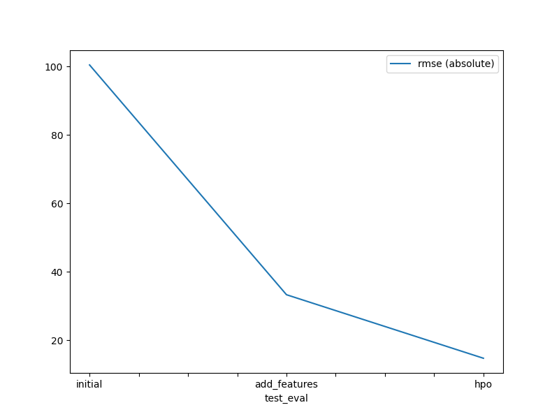
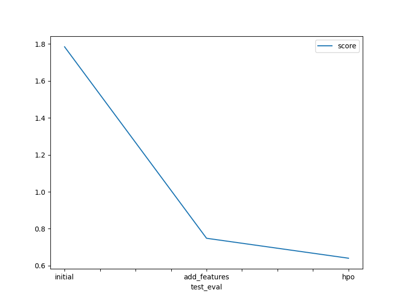

# Report: Predict Bike Sharing Demand with AutoGluon Solution
#### Stephan Schuhmann

## Initial Training
### What did you realize when you tried to submit your predictions? What changes were needed to the output of the predictor to submit your results?
Initially, the score and the theoretical leaderboard rank on the already finished competition were terrible (amongst the worst 2%).
Main problem was that there has not yet been any exploratory data analysis performed on the data. Thus, the feature set did not take into account some categorical features and no additional features have been exploited.

### What was the top ranked model that performed?
WeightedEnsemble_L3

## Exploratory data analysis and feature creation
### What did the exploratory analysis find and how did you add additional features?
Weather and season have been treated like simple integers, but actually, they represent categories. Thus, their datetypes have been corrected.
A simple way to add another feature was to extract the time of day (i.e., the hour) from the datetime column.

### How much better did your model preform after adding additional features and why do you think that is?
The score significantly improved from around 1.78 (rank 3167/3242) to around 0.75 (rank 2587/3242), since treating categorical features in the right way is very important. Another reason was the additional feature added to the set.

## Hyper parameter tuning
### How much better did your model preform after trying different hyper parameters?
By setting the hyperparameter optimization parameter to 'Auto' and increasing the maximum training time from 10 to 30 minutes, the score improved from around 0.75 to around 0.64 (rank 2359/3242).

### If you were given more time with this dataset, where do you think you would spend more time?
An extended EDA leading to further additional features would be my first choice, since there seem to be some cross-relationships between some of the feature.

### Create a table with the models you ran, the hyperparameters modified, and the kaggle score.
|model (WeightedEnsemble_L3)|hpo1 (TimeLimit_sec)|hpo2 (FeatureSet)|hpo3 (HyperparTuning)|score|
|--|--|--|--|--|
|initial|600|Standard|OFf|1.78377|
|add_features|600|Weather/Season as Categories + new feature 'Hour'|Off|0.74682|
|hpo|1800|Weather/Season as Categories + new feature 'Hour'|Auto|0.64080|
    
### Create a line plot showing the top model score for the three (or more) training runs during the project.

Training score by metric R2 score (the higher the better; 1 is best):

### Create a line plot showing the top kaggle score for the three (or more) prediction submissions during the project.
Submission score by kaggle score (the lower the better; 0 is best):

## Summary
TODO: Add your explanation
