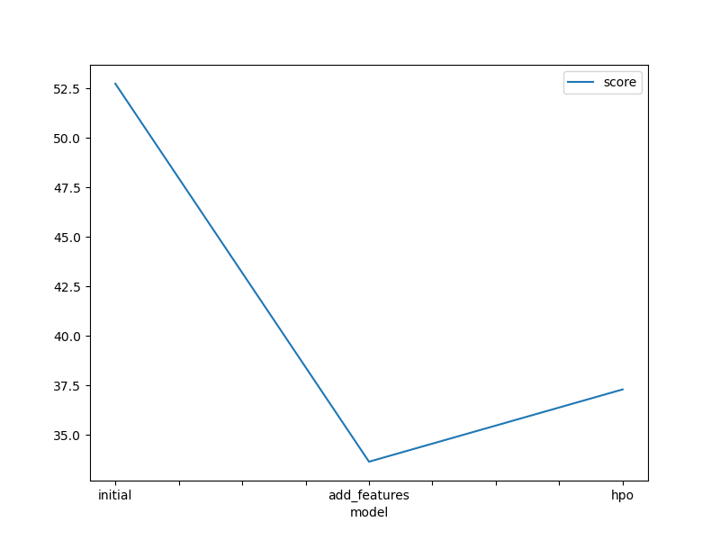
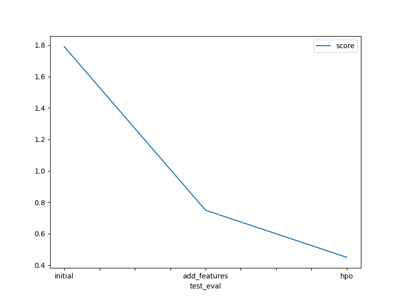

# Report: Predict Bike Sharing Demand with AutoGluon Solution
#### Satyam Chatrola

## Initial Training
### What did you realize when you tried to submit your predictions? What changes were needed to the output of the predictor to submit your results?
TODO: My outputs did not need any changes. All values were non-negative

### What was the top ranked model that performed?
TODO: WeightedEnsemble_L3

## Exploratory data analysis and feature creation
### What did the exploratory analysis find and how did you add additional features?
TODO: I found out that the data types of the features were not suitable. So, I converted timestamps to datetime format and then augmented new features such as month, year, hour and day of week to identify relevant bike renting patterns and demands.

### How much better did your model preform after adding additional features and why do you think that is?
TODO: The model performance improved drastically. This is thanks to appropriate representation of the data through suitable data types and new features which presented data in a more lucid manner to the models.

## Hyper parameter tuning
### How much better did your model preform after trying different hyper parameters?
TODO: After trying different hyperparameters, there was a small improvement from 0.66 to 0.48 on Kaggle scoreboard.

### If you were given more time with this dataset, where do you think you would spend more time?
TODO: I would definitely spend more time in data cleaning and feature engineering because we saw that the quality of data is what drastically affects model performance. "Garbage in, Garbage Out". But I would also try incorporating Neural Networks in Autogluon and see the difference that it creates.

### Create a table with the models you ran, the hyperparameters modified, and the kaggle score.
|model|hpo1:time_limit|hpo2:problem_type|hpo3:catboost|score|
|--|--|--|--|--|
|initial|600|Nan|Nan|1.84|
|add_features|600|Nan|Nan|0.66|
|hpo|1000|"regression"|"learning_rate: 0.03, iterations: 15, l2_leaf_reg: 0.125"|0.48|

### Create a line plot showing the top model score for the three (or more) training runs during the project.

TODO: Replace the image below with your own.

### Create a line plot showing the top kaggle score for the three (or more) prediction submissions during the project.

TODO: Replace the image below with your own.

## Summary
TODO: AutoGluon makes it easy to find a good performing model very quick. It is very good at quickly winding a "workable" model that could be the first checkpoint in our experimentation after the baseline models. But it still needs hyperparameter optimization and based on the hyperparameters, performance can be squeezed out of the models and data. But nothing discussed works if the quality of data and the features are not good. As we saw in the 1st and 2nd experiments, by not changing the hyperparameters and only improving the quality of data, the model performed way better with the same parameters.
